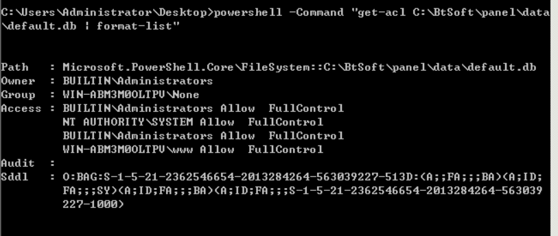
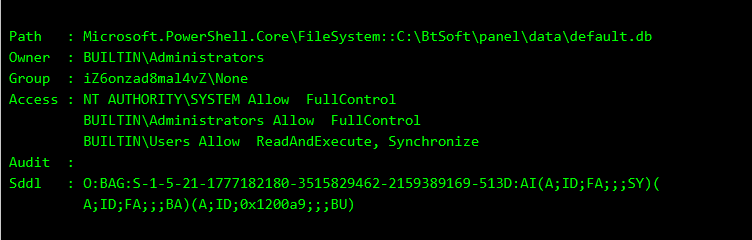
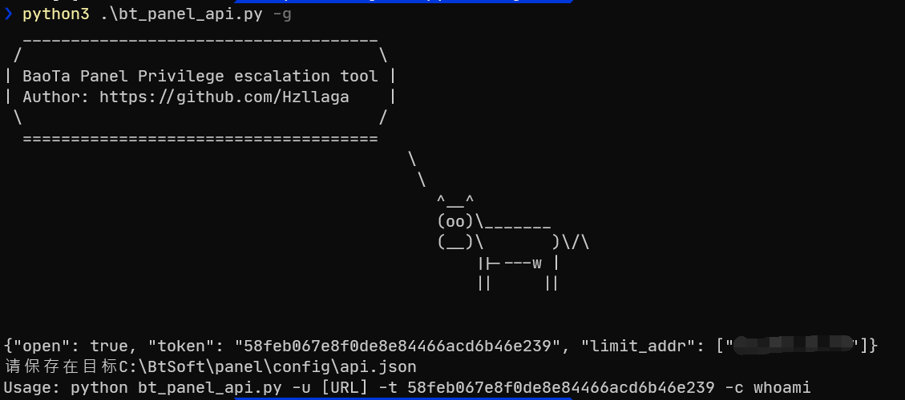
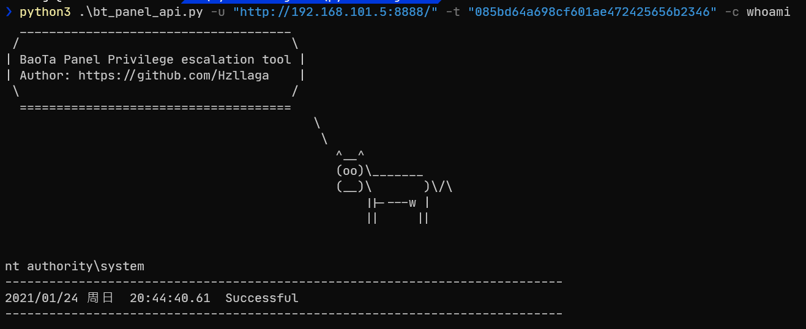

# 宝塔面板Windows提权方法


Table of Contents
=================

   * [宝塔面板Windows提权方法](#宝塔面板windows提权方法)
      * [写数据库提权](#写数据库提权)
      * [API提权](#api提权)
      * [计划任务提权](#计划任务提权)
   * [自动化测试](#自动化测试)


## 写数据库提权

宝塔面板在2008安装的时候默认www用户是可以对宝塔面板的数据库有完全控制权限的：

```bash
powershell -Command "get-acl C:\BtSoft\panel\data\default.db | format-list"
```



对于这种情况可以直接往数据库写一个面板的账号直接获取到面板权限，而在2016安装默认是User权限可读不可写



这种情况可以从里面读取一些敏感信息，比如mysql的root密码，而一般这个配置的不会只有这个文件可读，可以使用其他方法。


盐： `[A-Za-z0-9]{10}`

密码： `md5(md5(md5(password) + '_bt.cn') + salt)`

可以直接使用`bt_panel_script.py`，脚本会自动新建一个账号。


## API提权

宝塔面板支持API操作的，token在`C:\BtSoft\panel\config\api.json`，用这个方法提权还可以无视入口校验，比如有一个未授权访问的redis是system权限，就可以直接往这个文件覆盖token直接接管面板，或是利用filezilla(windows面板默认ftp软件就是filezilla+空密码)新建一个C盘权限的账号，也可以去修改那个文件来提权。


API Token: `md5(string)`

请求时加上(`multipart/form-data`)：

```
request_token = md5(timestamp + token)
request_time = timestamp
```

可以直接使用`bt_panel_api.py`，脚本会自动使用计划任务运行命令，如果面板原本就有配置好API了，并且IP限制127.0.0.1，那么就可以直接端口转发出来直接用脚本提权。


## 计划任务提权

基本上场景同API提权，可以去修改计划任务文件(比如网站备份)，默认是在凌晨1：30执行，权限也是system。


路径： `C:/BtSoft/cron/`

有些面板API会无法登陆，就只能利用计划任务来提权了，缺点是路径不固定，且执行时间也不固定。


# 自动化测试

```bash
python3 .\bt_panel_script.py
```

使用此脚本可以全自动获取宝塔相关信息，python可以直接用宝塔的，不用担心没环境。


```
python3 .\bt_panel_api.py -g
```

这个脚本可以生成api示例，把生成的json替换到指定文件后就能提权。



```
python3 .\bt_panel_api.py -u "http://192.168.101.5:8888/" -t "085bd64a698cf601ae472425656b2346" -c whoami
```

